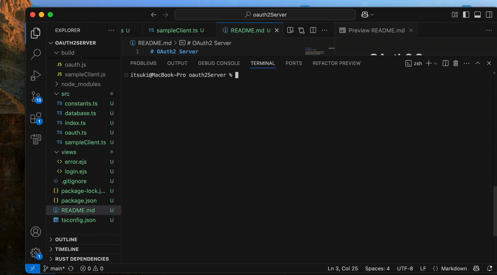

# OAuth2 Server + Dynamic Client Registration

This repository is an extension to the [BasicOAuth2Server](https://github.com/0Itsuki0/OAuth2Server) I have + the support of stateless [dynamic client registration](https://datatracker.ietf.org/doc/html/rfc7591)

It includes

- An OAuth2 Server supporting stateless [dynamic client registration](https://datatracker.ietf.org/doc/html/rfc7591) implemented with Express and [@node-oauth/oauth2-server](https://node-oauthoauth2-server.readthedocs.io/en/master/index.html), conforming to [specifications defined by OAuth 2.1 IETF DRAFT](https://datatracker.ietf.org/doc/html/draft-ietf-oauth-v2-1-12)

- A simple client for testing using [openid-client](https://github.com/panva/openid-client/tree/main).

For more details, please refer to my article (OAuth2Server With Dynamic Client Registration (Express/Typescript))[].

## Server
In addition to the endpoints supported by the [BasicOAuth2Server](https://github.com/0Itsuki0/OAuth2Server), a Registraion endpoint for dynamic client registration is added.

### Dynamic Client Registration
A **Stateless** (not keeping the metadata of the client in some kind of database), **opened registration** (without requiring intial access token) by the **client** (instead of developers).

- Client secret and other metadata are enocded to the ClientID using [crypto](https://nodejs.org/api/crypto.html#deciphersetauthtagbuffer-encoding).
- When verifying, decode the clientID to obtain the necessary information.

## Sample Client
The sample client will perform a dynamic client registration using [openid-client](https://github.com/panva/openid-client/tree/main) and subsequet actions such as code changes and request to protected endpoints.

## Run the Example
- `npm install` to install the dependencies
- `npm run dev` to
    - build the project
    - start the server
    - add some dummy data
    - run the client for testing